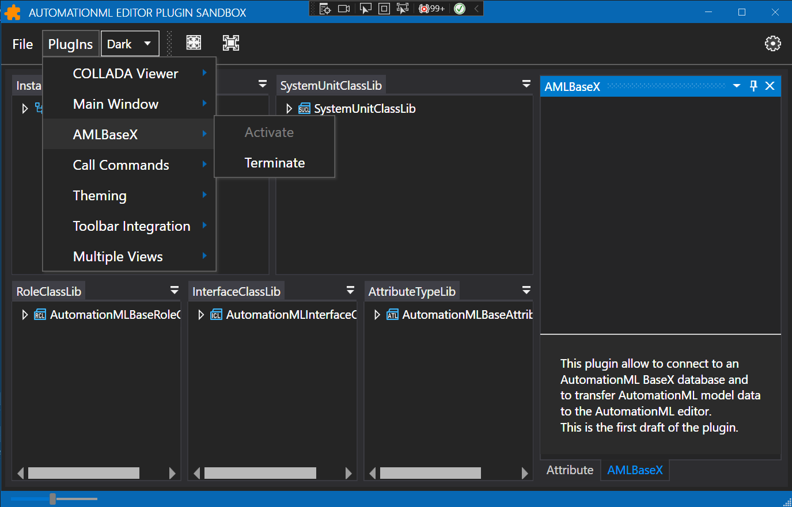

## Next Development Project
AutomationML documents should be able to be archived in a BaseX database and be directly visualizable and editable via a web interface in the AutomationML Editor. An editor plugin is to be developed for this purpose.

## AutomationML
[AutomationML (AML)](https://www.AutomationML.org) is a comprehensive XML based object-oriented data modeling language. It allows the modelling, storage and exchange of engineering models covering a multitude of relevant aspects of engineering. AML provides a comprehensive set of flexible mechanisms and innovations to model today’s engineering aspects as well as future engineering aspects to come. Its language characteristics allow to model existing or new domain models.

## AutomationML Editor
[AutomationML editor](https://github.com/AutomationML/AutomationMLEditor#readme) is a great tool to visualize, create and edit AutomationML files but has the limitation that only locally stored files of limited size can be processed efficiently.

## BaseX
[BaseX](https://basex.org/) is a robust, high-performance XML database engine and a highly compliant XQuery 3.1 processor with full support of the W3C Update and Full Text extensions. It serves as excellent framework for building complex data-intensive web applications. BaseX offers a RESTful API for accessing database resources via URLs. REST (**RE**presentational **S**tate **T**ransfer) facilitates a simple and fast access to databases through HTTP. The HTTP methods GET, PUT, DELETE, and POST can be used to interact with the database. 

## Aml.Editor.PlugIn.BaseX
It is, I think, a great idea if AutomationML documents could be archived in a BaseX database and be directly visualizable and editable via a web interface in the AutomationML Editor.

So I will try to develop a **BaseX Editor PlugIn** and report about the progress here. 

### 1.BaseX installation and creation of an AutomationML database
First I will install BaseX and try to store an AutomationML document in the database. I will report on this later.

### 2.Plugin development
The next step will be to create a simple editor plugin that makes document content from the database accessible to the AutomationML editor using the BaseX Rest-API. The PlugIn will be a C# .Net implementation. For the http requests, the .Net [HttpClient Class](https://learn.microsoft.com/en-us/dotnet/api/system.net.http.httpclient?view=net-7.0) will be used, which provides methods for sending HTTP requests and receiving HTTP responses from a resource identified by a URI. The API-client will be published as a free new [Aml.Engine](https://www.nuget.org/packages/Aml.Engine) package at [NuGet.org](https://www.nuget.org). The API-client project will be an Open Source project at GitHub. 

To start with PlugIn development you first need the PlugIn development resources, which you can get from GitHub using this command.

```shell
git clone https://github.com/AutomationML/AMLEditorPlugin.git
```

For the latest version of the editor the resources provided in the *PlugInDevelopment_V6*-folder are required. I create a copy of this folder and name the copy **Aml.Editor.Plugin.BaseX**. This will be the Plugin Identifier and the name of the new plugins namespace.  For the first version of the plugin I choose the example plugin *Aml.Editor.Plugin.Theming* as template. I copy the whole folder and name the copy *Aml.Editor.Plugin.BaseX* as well. In the copied files I have to replace the old namespace *Theming* with *BaseX* and change the project descriptions and the name of the project files as well.

To be identified as a new plugin, the package name should be set to the package identifier. The DisplayName of the plugin is set to *AMLBaseX*.

```c#
DisplayName = "AMLBaseX"
public override string PackageName => "Aml.Editor.Plugin.BaseX";
```

In order for the plugin to be published and loaded by the AutomationML Editor, the following settings in the project file are important:

```xml
<EnableDynamicLoading>true</EnableDynamicLoading>
<PackageTags>AMLEditorPlugin; AutomationML</PackageTags>
<ExcludeAssets>runtime</ExcludeAssets>
```

The *ExcludeAssets* is needed for all AutomationML package references which are used by the editor itself. The *PackageTags* are required, so that the package can be found.

### 3.First plugin test
This is all that is needed for the first executable version of the plugin. Activating the plugin in the AutomationML editor plugin sandbox application shows the result. The right toolbar is selected as the dock position.

	